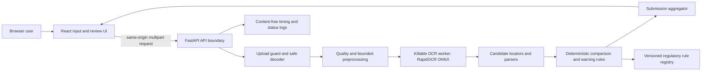

# BAIRD Product and Technical Assessment

**Stage:** BAIRD analysis  
**Intake basis:** CLEAR, 3 of 3 independent reviewers  
**Decision status:** Corrected architecture complete, pending BAIRD re-review  
**Implementation:** Not started

## 1. Decision summary

Build a single-origin modular monolith:

- React with TypeScript and Vite for the browser interface;
- FastAPI with Python 3.12 for the HTTP boundary and OCR/rule orchestration;
- RapidOCR 3.4.2 with ONNX Runtime 1.22.1 CPU and the exact `MODEL_BOM.md` artifacts as the selected self-contained OCR baseline;
- OpenCV/Pillow for bounded decode, quality analysis, orientation, crop, and enhancement;
- deterministic field-specific parsers, normalizers, comparison rules, and aggregation;
- one multi-stage Docker image that builds the React app and serves static assets plus `/api/v1` from FastAPI;
- no database, account system, remote image URLs, external inference, analytics, or persistent case state in the core;
- Fly.io `iad`, `shared-cpu-2x`, 2 GiB RAM, one always-running Machine, and an outbound policy that allows TCP 65535 while denying conventional ports 53, 80, and 443 as the preferred take-home host;
- Railway Hobby as an unselected convenience alternative because it does not provide the selected outbound port-policy control and its estimated always-ready memory cost is higher;
- Azure Container Apps with `minReplicas: 1` as the stakeholder-aligned future/fallback path.

This choice minimizes moving parts while protecting the assignment's hardest constraints: useful results in about five seconds, blocked outbound ML endpoints, honest evidence, simple UX, public deployment, and reproducibility.

## 2. Product conclusions

### 2.1 The product is an evidence comparator

The primary value is not generative explanation or autonomous compliance. It is a fast pipeline that finds visible text, links it to the image, applies transparent field policies, and routes uncertainty to a human.

The product therefore has three logical layers:

1. **Observe:** decode panels, assess quality, run OCR, return tokens/regions/confidence provenance.
2. **Compare:** identify field candidates, parse values, apply field-specific normalization, compare with reference data, and evaluate selected warning rules.
3. **Explain:** show original evidence, derived crop, state, reason, limitations, and next action.

No LLM belongs in the authoritative decision path. A future optional adapter may assist candidate extraction, but it cannot bypass deterministic rules or produce a clean result without visible evidence.

### 2.2 The first evaluator experience must be self-contained

The landing surface has two actions:

- Try sample, which loads a complete synthetic multi-panel distilled-spirits case;
- Check another label, which opens the structured reference and panel upload form.

Batch does not receive equal visual weight until it has passed its gated proof. This preserves clarity and avoids advertising an incomplete feature.

### 2.3 Three result surfaces are sufficient

1. **Input:** reference record, panels, validation, Try sample.
2. **Review:** image/panel viewer on the left; selected-check comparison on the right; quality, coverage, time, and limitations visible.
3. **Warning detail:** prescribed text and presentation observations, each with its own evidence and capability state.

The result table remains inspectable. It does not hide matches by default. Original and processed images are distinguishable. There is no chatbot, dashboard shell, named user, agency seal, or approval/rejection control.

## 3. Option analysis

The corrected comparison reports evidence grades instead of unsupported numeric precision. A candidate must satisfy all minimum criteria: no external runtime dependency, field-level evidence, zero false clean on the architecture slice, a credible five-second path, reproducible packaging, and redistributable artifacts with notices.

| OCR architecture | Same-workload evidence | Required-field result | Latency result | Runtime network | Distribution/control | Disposition |
|---|---|---|---|---|---|---|
| Server RapidOCR/ONNX CPU | 74 full architecture plus 74 browser attempts | Passed 37-case, 17-check field-level oracle with zero field errors and zero false clean | Browser p95 4.2133 s | None after build | Exact BOM, check-registry, rule-registry, and model hashes, hash-pinned research lock, Apache notices | **Selected** |
| Tesseract.js 6.0.1 | 30 recognition runs on same contact sheets | Missed clean brand, three-panel ABV, and high-resolution warning | Recognition p95 0.56 s | None when trained data bundled | Apache path is clear | Rejected as primary; possible targeted second reader only |
| Full PaddleOCR server | Not measured on this workload | Unknown | Unknown; expected larger footprint | Can be local | Apache project, exact model path unselected | Not an automatic fallback |
| Browser ONNX/WASM/WebGPU | Not measured | Device-dependent | Device and initial-download dependent | Initial model asset transfer | Reproducible but evaluator hardware varies | Deferred research option |
| External vision/document API | Not measured because it violates the core network boundary | Potentially strong | Network and firewall dependent | Required | Secret, retention, cost, and current-service lifecycle risk | Rejected for core |

### Selected OCR direction

RapidOCR/ONNX CPU is selected because it is self-contained, produces boxes and text, and passed the same-workload architecture slice. The exact artifacts and rights are resolved in `evidence/MODEL_BOM.md`. Release still requires the complete 30-fixture corpus and deployed benchmark. Failure reopens BAIRD or requires requester-approved scope change. No technology can silently remove a committed field family.

### Browser inference disposition

Browser inference is attractive for privacy and zero server compute. It is not selected for the first implementation because performance depends on device, browser, WASM/WebGPU support, initial model download, and tab lifecycle. The current support envelope includes Chrome and Edge, but a take-home evaluator should not need strong local hardware. Keep it as a future privacy-first option behind the same extraction contract.

## 4. BAIRD feasibility evidence

The reproducible architecture slice and raw runs are in `evidence/BAIRD_FEASIBILITY_REPORT.md`. On a process restricted to two logical CPUs, 74 full architecture runs produced p95 4.06284 s and 74 fixed Chrome attempts produced p95 4.2133 s. Completion was 100 percent, with zero timeouts, zero errors, zero field-oracle errors, zero missing required evidence, zero false clean, and zero false mismatch. The 37 cases exercise all 17 registry checks, including proof, warning applicability, exact punctuation, independent heading/body weight, panel coverage, image quality, duplicate country evidence, conflicting country candidates, decoys, and producer case/punctuation/missing behavior.

The maximum measured direct worker peak was 1,230,151,680 bytes, or 1.15 GiB. The selected 2 GiB instance therefore runs one OCR job at a time, with sequential source decode and a maximum 5.94 MP working canvas. A process-global pre-body gate admits at most two requests. Each admission reserves 50,593,792 bytes for the multipart parser copy plus the controlled request copy, so two admissions reserve 101,187,584 bytes inside a 128 MiB application spool quota. Two concurrent near-limit multipart flows reached 100,651,008 visible bytes and returned to a zero-byte baseline. The retained supplied-image crop observations remain exploratory only and are not expected-outcome fixtures.

Each admitted request has a 3.0 second total body deadline starting at pre-body admission. Chunk activity does not reset the clock. One application-owned multipart parser applies the selected limits on the real endpoint and explicitly closes completed and partial upload handles. A retained two-client multipart slow-drip test crossed the 1 MiB disk-spool threshold, sent chunks every 250 ms, rejected a third request before body receipt, returned result-free 408 responses near 3.0 seconds, restored bytes and counters to baseline, and accepted the next request.

The single OCR worker has a 200 ms queue-acquisition deadline. A waiting request returns 503 `worker_queue_busy` when that deadline expires. A separate supervisor owns request artifacts until the worker terminates or finishes, regardless of repeated caller cancellation. The actual ASGI-stack control test proved three cancellation calls, an eight-request abort storm, shutdown with active and waiting requests, worker replacement, exact cleanup, one-child recovery, and complete results after recovery.

Five true process-spawn trials produced a conservative cold-submission p95 of 11.55718 s, 1.55718 s above the Intake threshold. This is not a local cold-path pass. All five starts verified the exact selected model, selected-check registry, regulatory-rules registry, registry versions, and read-only asset state. Separate wrong model hash, wrong check-registry hash, wrong rules hash, missing rules, wrong rules version, and writable-asset processes never became ready. The selected topology keeps one Machine running and blocks traffic until readiness. `BG-003` remains a deployed stop that must pass before release.

## 5. Field capability decisions

| Check | Candidate extraction | Comparison | Aggregation treatment | BAIRD disposition |
|---|---|---|---|---|
| Brand name | OCR line/n-gram candidate with region | Exact Match; case-only difference Review; other normalization only by documented policy | Active | Build |
| Class/type | OCR line-group candidate with region | Exact/case-whitespace policy; uncertain semantic candidate Review | Active | Build |
| ABV | Regex over OCR tokens/lines | Decimal comparison after safe notation parsing | Active | Build |
| Proof | Regex, when present | Check against reference and two-times-ABV relationship | Active when reference or label presents proof | Build |
| Net contents | Quantity/unit parser | Canonical milliliters or liters; no approximate equality | Active | Build |
| Producer/bottler name and address | Anchor plus following line group | Exact/case/whitespace policy; punctuation/address variation Review | Active | Build with limited normalization |
| Country of origin | Origin anchors and line candidate | Exact/case policy | Active only for imported reference record | Build |
| Warning applicability | Parsed label/reference ABV plus warning-region presence and panel coverage | Below 0.5 percent makes warning detail not applicable; at or above 0.5 requires warning; uncertain ABV/coverage is Review | Active | Build |
| Warning wording | Heading anchor plus ordered text block | Canonical text with line-break/whitespace normalization only | Active | Build |
| Warning heading uppercase | OCR text plus crop | Deterministic when readable | Active | Build |
| Heading boldness and remaining text not bold | Crop/image heuristic with calibrated sufficient-evidence threshold | Relative presentation only when clear | Active; insufficient evidence is Review or Not verified | Build with capability limit |
| Separation and continuity | OCR/layout regions | Calibrated layout rule | Active; insufficient evidence is Review or Not verified | Build with capability limit |
| Contrast and legibility | Image statistics plus OCR agreement | Calibrated quality rule | Active; insufficient evidence is Review or Not verified | Build with capability limit |
| Panel coverage | Supplied panel count plus required field evidence | All required evidence evaluated or Review | Active | Build |
| Image quality | Per-panel bounded image metrics | Calibrated quality floor; insufficient evidence is Review | Active | Build |
| Physical type size/density | Requires volume plus reliable physical scale | Not reliable from arbitrary image | Outside automatic aggregation; explicit human check | Do not automate as Match |

`evidence/selected-check-registry.json` is the executable scope inventory, `evidence/regulatory-rules.json` is the executable regulatory source and value registry, and `WARNING_CAPABILITY_MATRIX.md` is authoritative for warning behavior. All 17 check-registry rows appear exactly once in every result. Every applicable Active row aggregates. I2R may assign calibrated thresholds within the stated evidence contract, but it may not remove or demote a registry row, change authoritative rule values, or change aggregation without reopening BAIRD.

## 6. Deployment analysis

| Host | Cold behavior | Container fit | Release/rollback | Cost/complexity | Disposition |
|---|---|---|---|---|---|
| Fly.io `iad`, one 2 shared-vCPU, 2 GiB Machine | One Machine kept running; readiness warmup | Good; measured worker peak 1.16 GiB | OCI digest promotion, health checks, Machine rollback | Current published class is below 15 USD monthly ceiling in selected region, final quote required | **Preferred take-home host** |
| Railway Hobby, Serverless disabled | Always-running service when sleeping is disabled | Good | Deployment history and startup health check | RAM is 10 USD per GB-month plus CPU; no selected outbound port-policy enforcement | Unselected convenience option |
| Azure Container Apps, min replicas 1 | Avoids scale-to-zero cold path | Good | Immutable revisions, readiness, traffic rollback | More account/infrastructure work | Stakeholder-aligned fallback/future |
| Render Free | About one-minute wake after idle | Container supported | Basic | Free but violates cold boundary | Rejected |
| Railway/Fly/Azure scaled to zero | Cold process/model start | Good | Platform dependent | Lower idle cost | Rejected for final evaluator URL unless measured below contract |

The release container loads and hash-checks the model, selected-check registry, and regulatory-rules registry, verifies their expected versions and read-only state, completes one representative inference, and only then passes readiness. Fly keeps one Machine running in `iad`. If the current quote exceeds 15 USD monthly, the measured two-CPU/2 GiB envelope fails, or the outbound policy cannot be read back, deployment stops and BAIRD reopens. The Fly claim is limited to the tested port property: 53, 80, and 443 denied, with TCP 65535 still allowed. Dependency and code inventory separately establish that the application declares no external inference, runtime model download, analytics, or crash-reporting service. Azure Container Apps with at least one replica and enforced outbound policy is the named reconsideration path, not an automatic substitution.

## 7. Architecture overview

No uploaded content enters a database, object store, analytics system, or external inference provider. No result bypasses the comparison and aggregation layers.

## 8. Architecture quality attributes

| Attribute | Required design response |
|---|---|
| Correctness | Typed schemas, pure field rules, independent expected manifests, holdouts, mutation tests |
| Explainability | Region/crop/snippet, raw candidate, parsed value, policy ID, reason, capability state |
| Latency | Preloaded model, bounded panels/pixels, synchronous core, stage timing, one ready replica, early benchmark |
| Resilience | Bounded queue, timeout, cancellation, per-panel error, no false clean fallback |
| Privacy | No database, no external inference, no raw-content logs, cleanup, synthetic-data notice |
| Security | Same-origin, content sniffing, safe decode/re-encode, limits, non-root container, dependency/model pinning |
| Accessibility | Semantic React components, keyboard flow, live status, focus management, text/icon states, axe/manual proof |
| Reproducibility | Docker image, `uv.lock`, `package-lock.json`, pinned model hashes, clean-checkout commands |
| Extensibility | Extraction adapter, versioned profile/rules, typed API, optional batch coordinator after core |

## 9. Key trade-offs

### Why Python plus React instead of one language

Python has the clearest OCR/image ecosystem and keeps the inference prototype small. React/TypeScript provides a maintainable evidence workspace and strong component/test tooling. A multi-stage single container avoids the operational cost normally associated with two stacks.

### Why not a database

The assignment does not require saved cases, accounts, or audit history. Persistence would add privacy, security, retention, migration, and deployment scope without improving the evaluator's core journey. Session state remains in the browser; system results remain in the response.

### Why not an LLM/VLM decision engine

The required checks are mostly extraction, parsing, comparison, and evidence presentation. A generative decision layer adds non-determinism and unsupported authority. OCR is still AI-powered, while deterministic rules make the result testable and explainable.

### Why synchronous core processing

The valid result target is about five seconds and the main flow handles one bounded submission. A durable job queue adds status persistence and failure recovery complexity. Synchronous request/response is simpler and makes end-to-end latency measurable. Batch, if delivered, gets a separate coordinator after core.

## 10. Hypothesis gates

| Gate | Hypothesis | Evidence required | Stop or fallback |
|---|---|---|---|
| `BG-001` | Selected OCR can support the committed field families. | PASS on equivalent envelope: 74 architecture runs across 37 cases and 17 checks, zero field errors, missing evidence, false clean, or false mismatch; 30-fixture release execution remains | Reopen BAIRD or obtain requester-approved scope change; no silent narrowing |
| `BG-002` | The one-container path can meet user-visible p95 at or below 5.0 s. | PASS on equivalent envelope: 74 fixed Chrome attempts, 100 percent complete, p95 4.2133 s | Deployed p95 failure blocks release and reopens host/resource decision |
| `BG-003` | Restart path remains below 10 s and is not routinely exposed. | NOT CLOSED LOCALLY: five true process-spawn trials had conservative p95 11.55718 s; one Machine remains running and readiness blocks traffic | Five deployed restarts at or above 10 s block release and reopen BAIRD |
| `BG-004` | At least 24 fixtures with 6 holdouts are sufficient. | PASS for design with 30 allocated fixtures in `evidence/FIXTURE_ALLOCATION.md` | Any new error class or false clean expands the corpus |
| `BG-005` | No declared external inference, runtime model-download, analytics, or crash-reporting dependency exists, and conventional outbound ports 53, 80, and 443 are denied. | Architecture direction selected: bundled hashes, dependency/code inventory, Fly port policy with only TCP 65535 allowed | Inventory mismatch, policy/readback mismatch, or successful 53/80/443 probe blocks release |
| `BG-006` | Request-scoped content is removed on every exit. | Architecture direction PASS: actual timeout and client cancellation retain request ownership until worker termination, replace the worker, return admission and spool reservations to zero, leave no request directories, and recover with a complete 17-row result | Full cleanup, actual multipart spool, or abort-storm failure changes worker/storage design |
| `BG-007` | Selected host fits 2 vCPU, 2 GiB, and 15 USD monthly ceiling. | Architecture PASS from 1.15 GiB measured direct worker peak and current Fly price | Current quote, peak, or CPU benchmark outside envelope reopens BAIRD |
| `BG-008` | Batch can process 250 synthetic rows without threatening core. | Deferred; not part of I2R core baseline | Omit unless all core gates pass first |

## 11. BAIRD recommendation

Advance this corrected architecture to I2R only after the same three BAIRD reviewers return CLEAR on one unchanged revision. I2R must preserve the measured boundaries, warning matrix, model BOM, fixture allocation, security contract, and stop gates. Implementation remains blocked until FRD and Build Instructions also clear their review gates.
