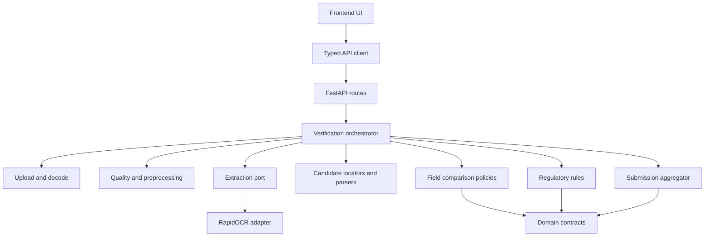

# BAIRD Engineering Blueprint

**Purpose:** Define the selected solution shape precisely enough for I2R to write binary requirements without beginning implementation.

## 1. Repository topology

```text
/
  frontend/
    src/
      api/
      components/
      features/verification/
      features/warning/
      fixtures/
      styles/
      test/
  backend/
    app/
      api/
      contracts/
      uploads/
      imaging/
      extraction/
      candidates/
      comparison/
      rules/
      aggregation/
      observability/
      security/
    tests/
  fixtures/
    images/
    manifests/
    holdout/
  scripts/
  docs/
  Dockerfile
  compose.yaml
  pyproject.toml
  uv.lock
  package.json
  package-lock.json
```

The exact filenames are assigned in Build Instructions. This topology conveys ownership and dependency direction.

## 2. Dependency direction



Rules and aggregation depend only on domain values, not FastAPI, OCR libraries, file objects, or React. The RapidOCR adapter implements an extraction port and is replaceable.

## 3. Component responsibilities

| Component ID | Responsibility | Forbidden responsibility |
|---|---|---|
| `BC-001` Frontend verification feature | Form, panel selection, progress, result/evidence rendering, focus/error management | Regulatory decisions or hidden normalization |
| `BC-002` API client | Multipart submission, abort, typed error mapping, timing mark | Business aggregation |
| `BC-003` API boundary | Schema validation, public error contract, request ID, orchestration entry | Direct OCR/rule logic |
| `BC-004` Upload guard | Two-request pre-body admission, two-copy spool reservation, 3.0 second total body deadline, actual-byte count, multipart limits, byte/panel/type/dimension validation, spool quota, and safe lifecycle | Candidate extraction |
| `BC-005` Imaging | Orientation, quality metrics, bounded derived images, coordinate transform | Legal result |
| `BC-006` Extraction port | Stable OCR result contract | Field-specific interpretation |
| `BC-007` RapidOCR worker adapter | Child lifecycle, model and registry hash/version/read-only readiness, warmup, OCR invocation, tokens/boxes/confidence/errors/timing | Reference comparison |
| `BC-008` Candidate locators | Map OCR tokens/lines to typed field candidates with evidence | Submission summary |
| `BC-009` Field policies | Parse, normalize, compare, reason, policy version | OCR invocation or UI wording |
| `BC-010` Regulatory registry | Canonical warning/rule constants, source/version metadata, capability | Network retrieval at runtime |
| `BC-011` Aggregator | Deterministic active-check and coverage precedence from `WARNING_CAPABILITY_MATRIX.md` | Reviewer override or non-aggregating active checks |
| `BC-012` Observability | Allowlisted metadata logs and stage timings | Raw inputs, OCR text, filenames |
| `BC-013` Security middleware | Headers, rate/concurrency controls, origin/error policies | User content storage |
| `BC-014` Fixture harness | Independent expected outcomes, mutations, holdout execution | Production result shortcuts |

## 4. Reference record contract

Selected typed request values. The JSON part is at most 32 KiB before parsing:

| Field | Type | Rule |
|---|---|---|
| `profile_id` | fixed enum | `distilled_spirits_demo_v1` only |
| `case_label` | optional string, 80 characters | Evaluator convenience, not logged |
| `brand_name` | string, 1 to 160 characters | Preserve source string |
| `class_type` | string, 1 to 240 characters | Preserve source string |
| `abv_percent` | decimal | Greater than 0 and at most 100; exact range refined by profile |
| `proof` | optional decimal | Non-negative; cross-check with ABV when present |
| `net_contents_value` | positive decimal | Paired with unit |
| `net_contents_unit` | enum | `mL` or `L` in first profile |
| `producer_name_address` | multiline string, 1 to 500 characters | Line structure preserved for display |
| `is_imported` | boolean | Controls country conditionality |
| `country_of_origin` | conditional string, 1 to 80 characters | Required only when imported |
| `panels` | 1 to 6 files plus optional panel label | Each panel independently validated |

The request never contains expected warning text. The versioned regulatory registry supplies it.

## 5. Extraction contract

Every adapter returns:

```text
ExtractionResult
  adapter_id
  model_id
  model_version
  model_sha256
  duration_ms
  panels[]
    panel_id
    image_width
    image_height
    orientation_applied
    quality_metrics
    tokens[]
      raw_text
      confidence_signal
      polygon[4]
      line_id
      reading_order
  warnings[]
  error: typed error or null
```

Confidence is an uncalibrated adapter signal unless later calibration proves otherwise. It is not an accuracy probability.

Typed error classes:

- model unavailable;
- model initialization failed;
- unsupported image after decode;
- inference timeout;
- inference resource limit;
- inference internal error;
- cancelled.

## 6. Candidate contract

Each candidate includes:

- field/check ID;
- raw token/line sequence;
- parsed value if parsing succeeded;
- panel and polygon/crop reference;
- candidate-selection method and policy version;
- OCR signal provenance;
- ambiguity alternatives where relevant;
- candidate state: Found, Ambiguous, Not found, Unreadable.

OCR, line formation, panel reading order, candidate generation, and primary candidate selection are reference-blind. They may use only observed tokens, boxes, lexical anchors, layout role, panel hints, image quality, and versioned field-location policy. Expected application values first enter at the comparison boundary after an observed candidate or explicit ambiguity set exists.

If multiple independently plausible candidates remain, the candidate state is Ambiguous and the field cannot be Match. The UI shows all material alternatives. Expected values may be displayed beside them but cannot resolve the ambiguity. Deterministic Mismatch requires sufficient field-role evidence that the selected observed value represents the field. Equality anywhere in the submission is never enough.

## 7. Comparison policy shape

Each field policy exposes:

- exact representation;
- safe parser;
- canonical representation;
- allowed transformations;
- transformations that force Review;
- mismatch rule;
- missing/ambiguous rule;
- reason code/message key;
- policy version;
- unit tests and fixture links.

No generic fuzzy threshold applies to every field.

Examples:

- brand: exact Match; case-only Review; punctuation change Review; no automatic semantic Match;
- ABV: parse supported notation and compare decimal value; no tolerance beyond representation precision defined in FRD;
- proof: compare label/reference and check expected relationship to ABV;
- net contents: convert exact L/mL quantities; typography variation does not change numeric value;
- warning: ignore OCR line wrapping and repeated whitespace only; prescribed word/punctuation mutation is Mismatch when readable.

## 8. Result contract

```text
VerificationResult
  request_id
  app_version
  profile_id/profile_version
  rule_sources[]
  server_duration_ms
  server_stage_timings
  panels[] quality and coverage
  fields[]
    check_id
    reference_display
    extracted_display
    parsed_reference
    parsed_candidate
    state
    applicable
    reason_code
    reason_text
    evidence_ref or null
    alternatives[]
      value
      evidence_ref
    policy_id/version
    capability
  human_only_limitations[]
  summary
  limitations[]
```

The internal state vocabulary is Match, Mismatch, Review, and Not verified. The UI may label Mismatch as Difference. The only submission summaries are `No differences found in checked fields`, `Review needed`, and `Differences detected`. The browser derives no alternate summary. It renders the server's deterministic summary and can independently assert schema validity. The browser records `user_visible_duration_ms` from Verify activation through result render and live-region update. This browser metric is not claimed by the server response and is the release latency metric.

## 9. API surface

| Method/path | Purpose | Notes |
|---|---|---|
| `GET /health/live` | Process liveness | No user content/model call |
| `GET /health/ready` | Model/rule/worker readiness | Fails until model and both registry hashes and versions pass, governed assets are non-writable, and representative warmup completes |
| `GET /api/v1/meta` | Safe immutable release tuple, profile, and limits | Source/image/model/rule identities, no secret/config internals |
| `GET /api/v1/samples` | Safe sample manifest metadata | Images may be static bundled assets |
| `POST /api/v1/verifications` | Synchronous verification | Multipart reference JSON plus 1 to 6 panels |

No general URL fetch, file retrieval, case list, history, delete, login, or admin route exists.

Public error shape:

```text
  request_id
  code
  message
  field_or_panel
  retryable
  next_action
```

Never include stack traces, local paths, raw values, provider secrets, or model internals.

## 10. Concurrency and cancellation model

- One Uvicorn HTTP process accepts requests asynchronously.
- A process-global middleware admits no more than two verification POSTs before body consumption. It reserves 50,593,792 bytes for each admission to cover both multipart and controlled request copies, at most 101,187,584 bytes, within a 128 MiB application spool quota. A third POST receives 503 without a body read.
- A 3.0 second total request-body deadline begins at pre-body admission. Chunk activity does not reset it. Expiry returns 408 `upload_timeout`, cleans partial request artifacts, and releases admission and spool reservations.
- Fly request concurrency is configured with soft limit 2 and hard limit 4. The application gate, not the edge default, controls verification body admission and preserves limited headroom for health/static GETs.
- The limiter allows one active request and 20 starts per 10 minutes per client digest, plus 30 starts per minute globally. The keyed table has at most 4,096 entries and a 15-minute inactive TTL.
- One application-owned multipart parser applies the 6-file, 1-field, 32 KiB field, 8 MiB per-file, and 24 MiB aggregate limits before route or decoder entry. Raw overflow and body-deadline exceptions propagate through this parser to exact 413 and 408 responses after explicit partial-file closure.
- One long-lived child process contains one model instance and executes one decode/contact-sheet/OCR/rule job at a time.
- The parent keeps the worker slot, input handles, and request directory owned by the child until the child actually exits or returns completion.
- Client disconnect suppresses delivery only. A separate worker supervisor owns the request directory. Any number of caller cancellations are deferred until actual worker completion or termination, so capacity and request artifacts are not released early.
- A 6.25 s worker safety deadline terminates and joins the child, clears readiness, and returns a result-free 504.
- The worker supervisor deletes artifacts after confirmed child exit. A background replacement warms while readiness and new verification starts return 503. Exact model and registry hashes, registry versions, read-only asset state, and warmup success restore readiness.
- One admitted request may wait 200 ms to acquire the worker. It then returns 503 `worker_queue_busy`. Requests beyond the two-admission gate are rejected before body consumption.
- Shutdown stops new intake, waits for owned supervisors through the worker deadline, then terminates and joins the child if needed and awaits cleanup before returning.
- Additional app workers or replicas are prohibited on the selected 2 GiB host unless a new memory/concurrency benchmark is approved.

## 11. Image processing policy

Allowed transformations for OCR input:

- EXIF orientation normalization;
- bounded downscale preserving aspect ratio;
- optional grayscale/contrast normalization;
- bounded deskew/rotation based on explicit evidence;
- safe re-encoding to an internal array.

Each source is capped at 12 MP and the request at 36 MP cumulative source pixels. Panels are decoded sequentially into fixed cells. The source buffer is closed before the next panel. The contact sheet is capped at 5.94 MP: 0.99 MP for one panel, 3.96 MP for two to four panels, and 5.94 MP for five or six panels.

Original evidence remains available. Every evidence polygon is transformed back to original coordinates. Preprocessing choice and duration are recorded. Do not use generative fill, super-resolution that invents glyphs, or irreversible UI replacement.

## 12. Quality metrics

Candidate metrics:

- decoded dimensions and aspect ratio;
- blur signal such as Laplacian variance;
- brightness distribution and clipping;
- glare/saturation area signal;
- OCR token count and text-area coverage;
- orientation confidence;
- panel-level inference error.

Thresholds are empirical routing aids, not label compliance. The FRD must bind each threshold to fixtures and a user action.

## 13. Test architecture

| Layer | Tool direction | Evidence |
|---|---|---|
| Pure Python policies | pytest | Branch/mutation coverage for parsing, normalization, warning, aggregation |
| Extraction adapter | pytest plus fixture images | Tokens/boxes/error/duration contract; no expected-value shortcuts |
| Upload/security | Raw ASGI client plus HTTPX | Three-client pre-body storm, two 250 ms slow-drip clients, 3.0 second total body expiry, two actual near-limit multipart flows, fixed, chunked, missing/understated length, part/file/field/byte/pixel/two-copy reservation/spool, Origin/Host, queue/cancel ownership/cleanup/client-rate/global-rate/key-cap/error tests |
| Frontend units | Vitest/Testing Library | Form conditions, status rendering, focus/error behavior, API mapping |
| API schema | OpenAPI snapshot plus contract tests | Frontend/backend compatible types and stable errors |
| Browser core | Playwright | Try sample, manual upload, evidence, retry, start-over |
| Accessibility | Playwright plus axe, manual keyboard/NVDA | Automated and human record |
| Performance | Browser timing harness plus server stage metrics | Fixed 74-attempt user-visible p95, cold, invalid, concurrency, result completeness, timeout recovery |
| Security/supply chain | dependency/container/secret scan | Release report and third-party notices |
| Holdout | Independent runner | 6 unseen fixture results after tuning freeze |

Coverage direction:

- 100 percent branch coverage for the small submission aggregator;
- at least 90 percent branch coverage for deterministic policies/rule registry;
- at least 80 percent line/branch coverage for backend and frontend business modules;
- no percentage substitutes for required negative, mutation, E2E, accessibility, or holdout tests.

## 14. Fixture manifest

Manifest fields:

- fixture ID/version;
- development or holdout partition;
- synthetic generation provenance;
- reference record;
- panel paths, labels, byte/pixel metadata, and controlled degradations;
- expected quality/coverage state;
- expected candidate and every applicable active-check state/reason code;
- expected submission summary;
- regulatory/profile/policy versions;
- whether included in performance benchmark;
- author/reviewer of expected outcome.

Expected outcomes are data, not imported from application rule constants. Holdout expected outcomes remain inaccessible to tuning code and are revealed only by the validation runner after tuning freeze.

## 15. Build and release quality gates

- Python lint/format/type checks;
- TypeScript compile and lint;
- unit/integration/E2E/accessibility tests;
- fixture schema and expected-outcome lint;
- no prohibited Unicode dash characters;
- no secrets or private design sources;
- dependency licenses/notices and vulnerability scan;
- deterministic container build and model hash;
- exact model BOM, selected-check registry and regulatory-rules registry hashes and versions, read-only governed assets, third-party notices, runtime-download denial, and offline readiness;
- non-root production image and health checks;
- local clean-checkout rehearsal;
- deployed performance/security/smoke evidence;
- immutable source/lock/base/image/model/rule/fixture/build/deployment tuple matches platform readback;
- README and UI claims match validation.

The retained local timing slice may use a test-only secret to bypass start-rate accounting while preserving concurrency admission, so 74 sequential fixed attempts can run without redefining the public abuse policy. That secret exists only when the benchmark process and research server receive the same explicit environment value. A separate negative test proves that a header alone cannot bypass rate limits. The product release build must not contain or configure a public rate bypass.

## 16. Failure and fallback rules

- No OCR candidate: Not verified, never copy reference into extracted value.
- Multiple plausible candidates: Review with alternatives/evidence.
- One panel failure: preserve other panel evidence but overall Review needed when an applicable check lacks evidence.
- Model failure: no partial clean result; actionable retry.
- Rule exception: stable internal-error state, no summary reuse from prior request.
- Upload timeout: at 3.0 s from pre-body admission, return result-free 408 `upload_timeout`, clean partial artifacts, and release both reservations. Chunk activity does not extend the deadline.
- Worker timeout: terminate and join the OCR child, clear readiness, emit a result-free 504, clean after confirmed exit, warm a replacement asynchronously, and return 503 for readiness and new verification starts until exact hashes, versions, read-only state, and warmup pass.
- Client disconnect: suppress delivery; shield and await cancellation while retaining worker ownership until true completion or termination; then clean and do not persist result.
- Host/model cold start: readiness blocks traffic until exact model and registry hashes, registry versions, non-writable governed assets, and representative inference complete; keep one Machine running.
- Systematic field-family failure: reopen BAIRD or use requester-approved scope change. Case-level uncertainty may route Review, but it cannot hide a non-working field family.

## 17. Batch extension seam

A batch coordinator may call the same internal verification orchestrator with bounded concurrency. It must not duplicate rules or use a separate result schema. Batch state can be client-managed for a take-home proof if refresh loss is explicit, but a durable production queue is outside scope.

Before batch code, I2R must decide:

- multi-file versus archive contract;
- manifest schema and row/image mapping;
- 250-row memory and duration envelope;
- cancel/retry semantics;
- result export schema;
- whether browser/session-only state remains usable for the proof;
- additional abuse and cleanup controls.
