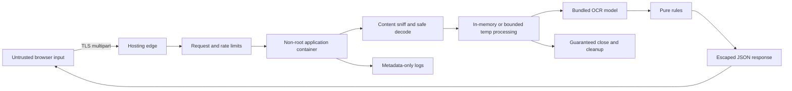

# BAIRD Security, Privacy, and Data Flow

**System class:** Public, unauthenticated take-home prototype  
**Data policy:** Synthetic or explicitly sanitized labels only  
**Persistence:** None by design

## 1. Trust boundary

The public browser and every uploaded byte are untrusted. The hosting edge, application container, bundled model files, and build pipeline are separate trust zones. No user-supplied filename, MIME header, text, metadata, URL, archive path, OCR output, or reference value is trusted as executable or safe display content.

## 2. Data inventory

| Data | Source | Sensitivity policy | Lifetime | Destination |
|---|---|---|---|---|
| Reference field values | Browser form/Try sample | Synthetic or sanitized only | Request and browser memory | Rule engine and response |
| Label panel bytes | Browser upload | Treat as potentially sensitive even with notice | Request processing only | Safe decoder/OCR; never served publicly |
| Decoded pixels and derived crops | Decoder/preprocessor | Same as image | Request processing only | OCR and response crop only if encoded in current response |
| OCR text/tokens/regions | OCR adapter | Potentially sensitive derived content | Request and browser memory | Candidate/rules/response |
| System findings | Rule engine | Low, but linked to content | Current response/browser memory | Browser only |
| Reviewer note/disposition | Browser | User-controlled text | Browser memory only | Not sent unless needed for a local UI action |
| Timing/status metadata | Application | Non-content operational metadata | Hosting log retention | Metadata-only log |
| Source IP and user agent | Fly Proxy | Network metadata outside application content | Provider-controlled proxy processing; no application-log retention claim | Fly Proxy |
| Application path, status, sizes, and timing | Application allowlisted log event | Operational metadata with no content, header, address, or query value | Current Fly application-log search is about 7 days | Private Fly project/log service |
| Model files and regulatory constants | Build/repository | Public controlled artifact | Container/repository | OCR and rules |

## 3. Public notice contract

Before upload, show:

> Unofficial prototype. Use only synthetic or sanitized test labels. Files are processed for this request and are not intentionally saved by the app. The hosting provider processes network metadata and retains application logs for about seven days. Do not upload confidential, personal, or production COLA information.

The final sentence may change only if implementation evidence requires more precise wording. Do not claim that nothing is ever stored if framework spooling, hosting logs, crash collection, or a provider contradicts it.

## 4. Upload controls

### 4.1 Core image allowlist

- extensions: `.jpg`, `.jpeg`, `.png`, `.webp`;
- detected formats: JPEG, PNG, WebP only;
- maximum 6 images;
- maximum 8 MB per encoded image;
- maximum 24 MiB aggregate encoded file payload;
- maximum 25,296,896 raw request bytes, which includes 24 MiB plus 128 KiB multipart overhead;
- maximum 12 million decoded pixels per image;
- maximum 36 million cumulative decoded source pixels per request;
- maximum 5.94 million working-canvas pixels;
- no SVG, PDF, HEIC, TIFF, GIF, remote URL, base64 JSON, archive, or executable input in the core.

### 4.2 Validation order

1. A process-global admission middleware runs before body consumption. It admits at most two verification POSTs and reserves 50,593,792 bytes for each, covering both the multipart parser copy and the controlled request copy. A third POST receives 503 without a body read. The 101,187,584-byte maximum reservation fits within the 128 MiB application spool quota.
2. A 3.0 second total request-body deadline starts at pre-body admission. Chunk activity does not reset it. Expiry returns 408 `upload_timeout`, cleans any partial request artifacts, releases admission and spool reservations, and records only content-free status/timing data.
3. An ASGI receive-count middleware counts actual body bytes before the route handler. A declared `Content-Length` above 25,296,896 returns 413 immediately. Missing or understated length does not bypass the streaming count. Malformed length returns 400.
4. The middleware stops forwarding bytes and returns 413 when the streamed count exceeds the raw cap. The route handler and image decoder are not invoked.
5. One application-owned multipart parser on the real endpoint permits at most 6 files, 1 non-file field, 7 total parts, and a 32 KiB reference field. It counts encoded file bytes per part and in aggregate. A file above 8 MiB, aggregate file payload above 24 MiB, extra field, or extra file returns 413 before route and decoder entry. Malformed multipart returns 400. Schema omissions return 422.
6. Uploads spool after 1 MiB into one generated request directory under `/tmp/labelverify`, mode 0700. At most two request directories can exist from admitted POSTs. The runtime user owns them. User filenames never become paths. No persistent volume is mounted.
7. Check extension only as an early usability signal, then sniff signature and decoder-detected format.
8. Read dimensions with decompression-bomb protection before full decode. Reject any image above 12 MP or cumulative source dimensions above 36 MP before the first full decode.
9. Decode one panel at a time. Normalize orientation, strip metadata, reduce it to its bounded cell, paste into the contact sheet, close the full-resolution buffer, and continue.
10. Reject a working canvas above 5.94 MP. At most one contact sheet and one decoded source panel are resident alongside the model.
11. Never write or serve an original under a web-accessible path. Evidence responses use safe bounded re-encoding or browser-local object URLs.
12. The multipart owner synchronously closes every completed or partial upload handle on success, limit, malformed input, raw overflow, body timeout, cancellation, and downstream completion. After controlled copies exist, a separate worker supervisor owns the request directory until worker completion or confirmed worker termination. Repeated caller cancellation is deferred until that ownership ends.

File extension, MIME header, and signature are defense layers, not sufficient alone.

## 5. Abuse and threat cases

| Threat ID | Threat | Control | Required proof |
|---|---|---|---|
| `THR-001` | Oversize or concurrent bodies exhaust memory/disk | Two-request pre-body admission, two-copy accounting, 128 MiB spool quota, actual-byte ASGI receive guard, exact multipart limits, 413 before handler/decode | Three-client pre-body storm, two actual near-limit multipart flows, fixed-length, understated, missing-length, chunked, part-count, reservation, and spool-baseline tests |
| `THR-002` | Decompression bomb | Pixel limits, decoder warnings as errors, cumulative pixel budget | Crafted high-expansion image test |
| `THR-003` | Spoofed MIME/extension/polyglot | Content sniff, real decode, safe re-encode/internal pixels | Mismatch/spoof fixture matrix |
| `THR-004` | Decoder exploit | Current patched decoder libraries, smallest format set, non-root container, resource bounds | Dependency scan and malformed corpus |
| `THR-005` | Path traversal/unsafe filename | Ignore input path, generated internal identifier, no archive in core | Traversal filename test |
| `THR-006` | SSRF through image URL | Do not accept remote URLs | Schema and route tests |
| `THR-007` | OCR/reference text causes XSS | JSON encoding; React text rendering; no `dangerouslySetInnerHTML`; CSP | Payload fixtures and browser test |
| `THR-008` | Repeated OCR causes CPU denial | Normalized trusted Fly client identity, bounded per-client and global start buckets, capped/expiring key table, one killable OCR child, one short pending slot, immediate pre-body overload | Public-edge supplied/duplicate/malformed trusted-header tests, arbitrary forwarding-header tests, 4,096-key/TTL proof, client/global bursts, abort storm, child count, CPU, and recovery |
| `THR-009` | Slow or parallel upload ties connections | Two-request pre-body gate, full two-copy reservation, application-owned multipart parser, 3.0 second total body deadline from admission with no activity reset, application spool quota, and edge limit | Two admitted slow-drip multipart clients cross the 1 MiB disk-spool threshold, third pre-body rejection, exact result-free 408 expiry, explicit handle closure, byte/directory/counter baseline, and recovery request |
| `THR-010` | Content leaks to logs or response caches | Allowlisted structured log fields only; exception redaction; no request/body/text/filename logs; no-store/private and no-cache on covered responses | Log capture plus public-Fly cache-header tests for success, evidence, validation, decode, overload, timeout, and internal error |
| `THR-011` | Content remains in temp files | Worker owns artifacts until true exit; parent joins or terminates before outer finalizer removes mode-0700 directory | Filesystem baseline after every exit and disconnect storm |
| `THR-012` | Dependency/model tampering | Lockfiles, immutable base/image digests, exact model BOM/hashes/notices, SBOM, release tuple | Clean rebuild, image readback, and hash comparison |
| `THR-013` | Runtime telemetry or outbound traffic leaks metadata | No declared analytics/crash SDK or external inference/runtime-download dependency, no credentials, bundled runtime assets, and Fly port policy denying conventional 53/80/443 | Dependency/code inventory, policy readback, DNS and direct-IP HTTP/HTTPS probes, and disclosure that TCP 65535 remains allowed |
| `THR-014` | Clickjacking or unsafe browser capabilities | CSP frame ancestors none, X-Frame-Options DENY, Permissions-Policy deny unused features | Header test |
| `THR-015` | Cross-origin abuse | Release CORS disabled; exact Host and Origin table; no credentialed cross-origin requests | Wrong/missing/null Origin, Host, and preflight tests |
| `THR-016` | CSRF | No cookies or persistent mutation; exact Origin required for multipart POST | Cross-site form/fetch POST tests |
| `THR-017` | Information exposure from errors | Stable public error codes; no stack traces/model paths | Production-mode error tests |
| `THR-018` | ZIP bomb or archive traversal in batch | No ZIP in core; batch requires separate archive ADR or multi-file-only contract | Batch gate blocks archive until controls exist |

## 6. Client identity, rate, concurrency, and timeout envelope

### 6.1 Trusted client identity

The Fly deployment has no additional proxy in front of Fly Proxy. The app trusts exactly one syntactically valid `Fly-Client-IP` value only in the Fly profile and ignores `X-Forwarded-For` and `X-Real-IP`. Missing, malformed, comma-joined, or duplicate trusted values fail closed before limiter lookup. Direct access to the internal application port is not public. Local Docker and tests use the socket peer address and ignore all forwarding headers. A future additional proxy requires a new resolver and threat review.

The limiter stores a keyed digest made with a process-local random secret. It never logs the raw address or digest. Process restart resets the limiter and the single-replica design does not claim distributed accuracy.

### 6.2 Origin and host decision

| Request | Host | Origin | Result |
|---|---|---|---|
| Browser POST | Exact public host | Exact `https://` public origin | Allow |
| Browser POST | Exact localhost test host | Matching localhost origin | Allow only outside release profile |
| Browser POST | Any allowed host | Missing, `null`, or wrong origin | 403 |
| Browser POST | Wrong host | Any | 400 |
| Preflight or cross-origin request | Any | Any non-public origin | No CORS allow headers; deny |
| Health GET | Internal or public health host | Origin not required | Allow only health route |

There are no cookies, credentials, or persistent mutations. CORS middleware is disabled in release rather than configured broadly.

### 6.3 Exact capacity

- 1 active verification per client digest;
- 20 verification starts per 10 minutes per client digest;
- 30 verification starts per minute across the process;
- no more than 4,096 client-digest records, with inactive records removed after 15 minutes;
- 1 active OCR worker job globally on the selected 2 vCPU, 2 GiB Machine;
- 2 verification POSTs admitted before body consumption, comprising 1 active OCR job and at most 1 admitted request waiting up to 200 ms for the worker;
- 50,593,792 bytes reserved for each admitted POST to cover two file copies, 101,187,584 bytes total, within a 128 MiB spool quota;
- 3.0 second total request-body deadline starting at pre-body admission, with no reset from chunk activity;
- overload returns 429 or 503 before body consumption;
- Fly request concurrency uses soft limit 2 and hard limit 4, while the application two-POST gate remains the controlling body-admission bound and leaves headroom for health/static GETs;
- a disconnect suppresses delivery, but a worker supervisor owns artifacts independently and repeated cancellation cannot release the worker slot or delete worker-owned artifacts until actual worker completion or termination;
- worker timeout terminates and joins the child, clears readiness, and returns 504 before capacity is restored;
- a start-and-abort storm can never create more than one actual OCR child job, and shutdown cannot return until owned work has completed or its child has been terminated and joined.

### 6.4 Latency budget and timeout order

| Stage | Warmed p95 budget |
|---|---:|
| Client validation and form assembly | 75 ms |
| Upload and edge transit for benchmark inputs | 425 ms |
| Raw-body guard, multipart spool, and schema | 125 ms |
| Queue | 50 ms |
| Decode, quality, and contact sheet | 300 ms |
| OCR, candidate, rules, and serialization | 3,500 ms |
| Response transfer, render, and live-region update | 200 ms |
| Total | 4,675 ms |

The browser user-visible clock is the release metric. The server returns separate queue, decode/preprocess, OCR, rules, and response-build timings. A 5.0-second result is a p95 target, not itself a success shortcut.

The total upload/body deadline is 3.0 s from pre-body admission and is independent of activity. Expiry returns a result-free 408 `upload_timeout` after partial-artifact cleanup and reservation release. The worker lock then has a separate 200 ms acquisition deadline. The child OCR safety deadline is 6.25 s from dispatch. At expiry the parent terminates and joins the failed child, clears readiness, and returns a result-free 504. The outer finalizer then removes request artifacts. A replacement child warms asynchronously. During that interval `/health/ready` and new verification starts return 503. The replacement is accepted only after exact model, selected-check registry, regulatory-rules registry, registry-version, read-only-asset, and representative-warmup checks pass. The browser shows an actionable non-clean timeout and aborts at 7.5 s from Verify activation. Fly connection idle timeout, if configured, is a separate edge control and is not a total request-body deadline. These hard security bounds are independent of the 5.0-second p95 target. A valid result between 5.0 and 7.5 seconds remains observable and counts in the fixed-attempt distribution. The deployed benchmark reports every attempted valid run, requires 100 percent complete results, and cannot replace timeouts with retries. A killed worker returns no partial field result.

## 7. Browser security headers

- `Content-Security-Policy`: default self; explicit script/style/image/connect allowances only;
- `X-Content-Type-Options: nosniff`;
- `Referrer-Policy: no-referrer`;
- `Permissions-Policy`: deny camera, microphone, geolocation, payment, and other unused capabilities;
- `X-Frame-Options: DENY` or equivalent CSP `frame-ancestors 'none'`;
- `Cache-Control: no-store, private` and `Pragma: no-cache` on verification responses, evidence, and errors;
- `Cross-Origin-Opener-Policy` and related isolation only if compatible and tested;
- HTTPS enforced by the host.

Uploaded content is never returned under its original MIME type or a public URL. Evidence crops in a response are safe re-encodings with bounded dimensions, or the browser uses its original local object URL without sending a second copy.

## 8. Container controls

- run as an unprivileged user;
- no shell or compiler in final image where practical;
- do not mount a persistent volume;
- write only to a size-bounded temporary directory if required;
- pin base image by digest for release;
- expose one application port;
- load models and both registries from read-only image content;
- reject runtime model downloads;
- readiness fails until exact model, selected-check registry, and regulatory-rules registry hashes and versions pass, every governed asset is non-writable, and one representative inference completes;
- graceful shutdown stops accepting work and bounds active-request completion;
- promote by immutable OCI digest and run the exact source-to-deployment tuple in `ADR-008`;
- apply and read back the selected Fly network policy before public smoke tests;
- allow only outbound TCP destination port 65535 in that policy, and prove conventional DNS 53, HTTP 80, and HTTPS 443 fail;
- scan dependencies and container before release.

Hosting platforms differ in control availability. Every claimed control must be verified on the selected platform, not assumed from Dockerfile intent. The selected Fly policy is a port-level control. Because TCP 65535 remains allowed, it does not prove that arbitrary outbound application traffic is impossible. Public and release claims must not exceed the specific denied-port probes plus dependency and code inventory.

## 9. Logging and observability contract

Allowed fields:

- generated request ID;
- application version/commit and model/rule versions;
- route name and HTTP status;
- aggregate byte/pixel/panel counts;
- stage durations and total duration;
- field-state counts without field text;
- error category/code;
- queue/concurrency state;
- process health metrics.

Forbidden fields:

- raw or normalized reference values;
- OCR text or warning text from the upload;
- image bytes, crops, hashes, EXIF, or original filenames;
- reviewer notes;
- full IP/user agent unless hosting infrastructure records them outside application control;
- exception objects that include user content.

Fly stores what the application writes to stdout/stderr in its private application log search for about seven days. The app emits only the allowlisted fields above. It does not emit request headers, source addresses, query strings, original paths, or content. Fly Proxy still processes source IP and user agent as network metadata, which the public notice discloses. Verification values never appear in routes or query strings.

On Start over, the browser revokes all object URLs, replaces result/reference state, clears file inputs, and releases derived blobs. Page lifecycle cleanup performs the same revocation where practical.

## 10. Cleanup proof matrix

| Exit path | Upload close | Temp cleanup | Memory/reference release | Raw-content log assertion |
|---|---|---|---|---|
| Success | Required | Required | Required | Required |
| Client validation rejection | No upload accepted | N/A | Required | Required |
| App validation rejection | Required | Required | Required | Required |
| Decode error | Required | Required | Required | Required |
| OCR error | Required | Required | Required | Required |
| Rule error | Required | Required | Required | Required |
| Timeout | Required | Required | Required | Required |
| Cancellation/disconnect | Required | Required | Required | Required |
| Unhandled internal error | Required through outer finalizer | Required | Required | Required |

## 11. Batch security gate

Prefer a manifest plus explicit multi-file selection to avoid archives. If a ZIP is later selected, require all of the following before code:

- no nested archives;
- path normalization and traversal rejection;
- duplicate/case-collision handling;
- per-entry and total compressed/uncompressed byte limits;
- maximum ratio, entry count, depth, and filename length;
- symlink/device/special-file rejection;
- allowlisted image/CSV entries only;
- extraction into an isolated bounded temporary directory;
- cleanup on every path;
- malicious archive fixtures.

## 12. Security acceptance boundary

This is not a production federal security architecture. It is a defensible public-prototype boundary. Any introduction of real application data, authentication, persistence, external inference, analytics, saved history, or production agency deployment requires a new threat model, privacy/retention design, and authorization review.
